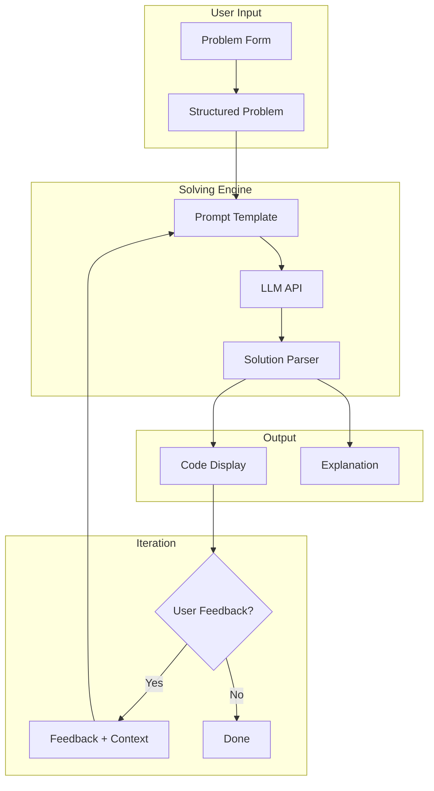
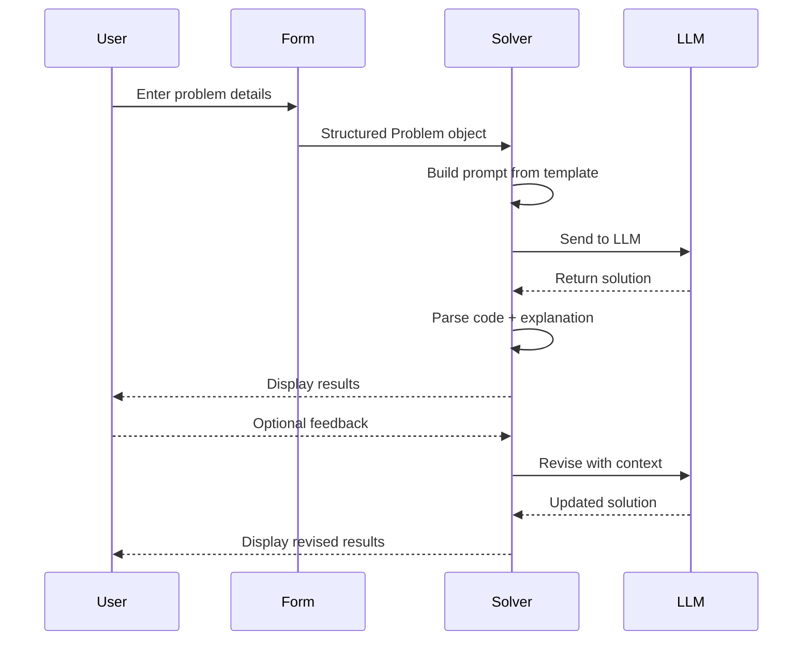

<](LICENSE)
[](https://www.typescriptlang.org/)
[](https://nodejs.org/)

---

A terminal-based agent that takes competitive programming problems and returns finished solutions. Enter the problem once, get the code.

```
$ dotpp solve

╔══════════════════════════════════════════════════════════╗
║  Competitive Programming Solver                         ║
╠══════════════════════════════════════════════════════════╣
║                                                         ║
║  Title: Two Sum                                         ║
║  ──────────────────────────────────────────────          ║
║  Statement: Given an array of integers and a target,    ║
║  return indices of two numbers that add up to target.   ║
║                                                         ║
║  Examples:                                              ║
║  ┌─ Example 1 ──────────────────────────────────────┐   ║
║  │  Input:  [2,7,11,15], target=9                   │   ║
║  │  Output: [0,1]                                   │   ║
║  │  Why:    indices 0 and 1 sum to 9                │   ║
║  └──────────────────────────────────────────────────┘   ║
║  [+ Add Example]                                        ║
║                                                         ║
║  [Submit]  [Cancel]                                     ║
╚══════════════════════════════════════════════════════════╝

Solving...

╔══════════════════════════════════════════════════════════╗
║  Solution                                               ║
╠══════════════════════════════════════════════════════════╣
║  def twoSum(nums, target):                              ║
║      seen = {}                                          ║
║      for i, n in enumerate(nums):                       ║
║          complement = target - n                        ║
║          if complement in seen:                         ║
║              return [seen[complement], i]               ║
║          seen[n] = i                                    ║
║  return []                                              ║
╚══════════════════════════════════════════════════════════╝

Provide feedback? (y/n): _
```

</div>

## Why dotpp?

Most LLM coding tools are built for general software engineering. They don't understand competitive programming problems, don't know how to present examples, and require you to paste raw text into a chat window.

**dotpp** is purpose-built for competitive programming:

- Structured problem entry (title, statement, examples with explanations)
- Code-only or code-with-explanation output
- Multi-turn iteration with feedback
- Language-agnostic solutions
- Runs in your terminal, no GUI needed

## Architecture



## How It Works



## Features

| Feature | Description |
|---------|-------------|
| **Structured Input** | Title, statement, and unlimited examples with explanations |
| **Code + Explanation** | Toggle between code-only and code-with-complexity-analysis modes |
| **Multi-turn Iteration** | Provide feedback and get revised solutions |
| **Language Agnostic** | Works with Python, C++, Java, Rust, and more |
| **Terminal Native** | TUI interface, no browser, no GUI |
| **Multiple Providers** | Claude, GPT-4, Gemini, Mistral, and 900+ models |

## Installation

```bash
# Clone the repository
git clone https://github.com/YOUR_USERNAME/dotpp.git
cd dotpp

# Install dependencies
npm install

# Build
npm run build

# Link globally (optional)
npm link
```

## Quick Start

```bash
# Start solving
dotpp solve

# With explanation mode
dotpp solve --explain
```

## Configuration

Set your API key as an environment variable:

```bash
# Anthropic
export ANTHROPIC_API_KEY="sk-ant-..."

# OpenAI
export OPENAI_API_KEY="sk-..."

# Google
export GOOGLE_API_KEY="..."
```

## Project Structure

```
dotpp/
├── packages/
│   ├── ai/              # Unified LLM API (900+ models)
│   ├── agent-core/      # Agent runtime
│   ├── coding-agent/    # CLI + TUI
│   │   └── src/
│   │       ├── solver/     # Problem solving engine
│   │       ├── forms/      # TUI components
│   │       └── commands/   # CLI commands
│   └── tui/             # Terminal UI components
└── docs/
    ├── brainstorms/     # Requirements docs
    └── plans/           # Implementation plans
```

## Development

```bash
# Run tests
npm run test

# Type check
npm run check

# Build all packages
npm run build

# Build binary (requires Bun)
npm run build:binary
```

## Contributing

Contributions welcome. Please:

1. Fork the repository
2. Create a feature branch (`git checkout -b feat/my-feature`)
3. Commit your changes (`git commit -m 'feat: add my feature'`)
4. Push to the branch (`git push origin feat/my-feature`)
5. Open a Pull Request

## Roadmap

- [ ] Problem import from URLs
- [ ] Language selection UI
- [ ] Custom test case execution
- [ ] Problem bank and progress tracking
- [ ] Contest simulator mode
- [ ] Platform integration (Codeforces, LeetCode, AtCoder)

## License

MIT

---

<div align="center">

**Built with [pi](https://github.com/earendil-works/pi) agent harness.**

</div>
]]>