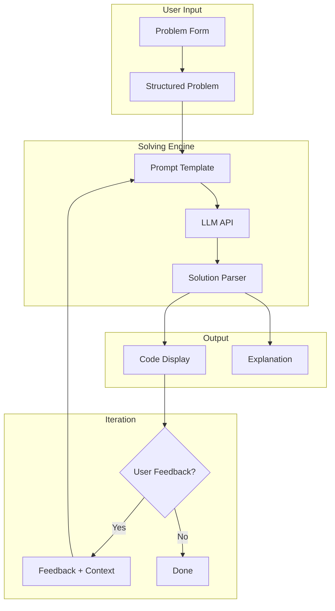
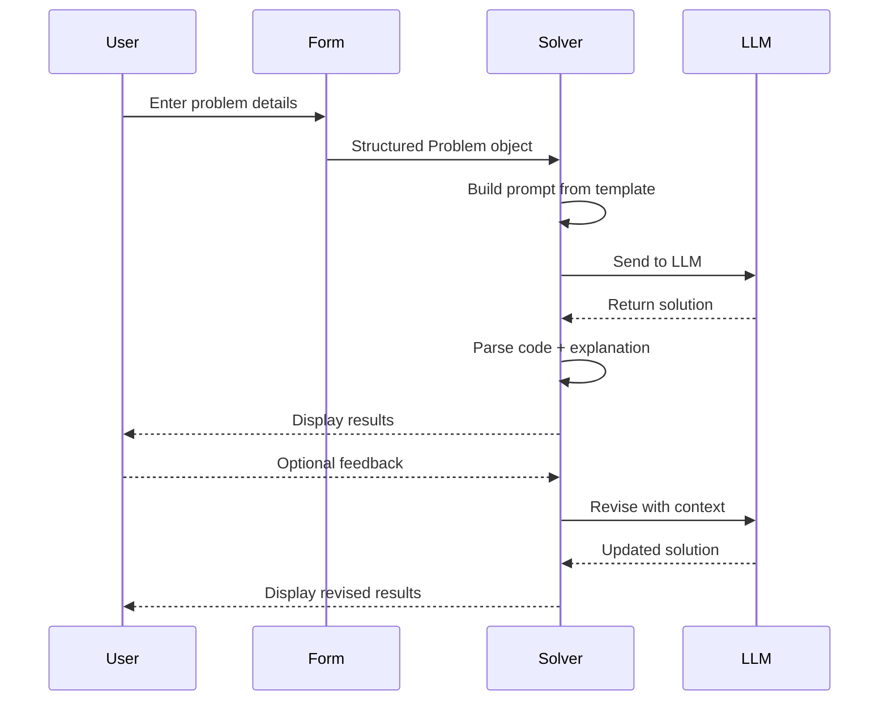

<div align="center">

# dotpp

**Competitive Programming Agent**

*Solve problems, not boilerplate.*

[](LICENSE)
[](https://www.typescriptlang.org/)
[](https://nodejs.org/)

---
A terminal-based agent that takes competitive programming problems and returns finished solutions. Enter the problem once, get the code.
**Features:**
- Structured problem entry with title, statement, and unlimited examples
- Optional explanation field for each example to help the LLM understand context
- Code-only or code-with-explanation output modes
- Multi-turn iteration with feedback
- Language-agnostic solutions (Python, C++, Java, Rust, and more)
- Supports Claude, GPT-4, Gemini, Mistral, and 900+ other models
</div>

## Why dotpp?

Most LLM coding tools are built for general software engineering. They don't understand competitive programming problems, don't know how to present examples, and require you to paste raw text into a chat window.

**dotpp** is purpose-built for competitive programming:

- Structured problem entry (title, statement, examples with explanations)
- Code-only or code-with-explanation output
- Multi-turn iteration with feedback
- Language-agnostic solutions
- Runs in your terminal, no GUI needed

## Architecture



## How It Works



## Features

| Feature | Description |
|---------|-------------|
| **Structured Input** | Title, statement, and unlimited examples with explanations |
| **Code + Explanation** | Toggle between code-only and code-with-complexity-analysis modes |
| **Multi-turn Iteration** | Provide feedback and get revised solutions |
| **Language Agnostic** | Works with Python, C++, Java, Rust, and more |
| **Terminal Native** | TUI interface, no browser, no GUI |
| **Multiple Providers** | Claude, GPT-4, Gemini, Mistral, and 900+ models |

## Installation

```bash
# Clone the repository
git clone https://github.com/akorite/dotpp.git
cd dotpp

# Install dependencies
npm install

# Build
npm run build

# Link globally (optional)
npm link
```

## Quick Start

```bash
# Start solving
dotpp solve

# With explanation mode
dotpp solve --explain
```

## Configuration

Set your API key as an environment variable:

```bash
# Anthropic
export ANTHROPIC_API_KEY="sk-ant-..."

# OpenAI
export OPENAI_API_KEY="sk-..."

# Google
export GOOGLE_API_KEY="..."
```

## Project Structure

```
dotpp/
├── packages/
│   ├── ai/              # Unified LLM API (900+ models)
│   ├── agent-core/      # Agent runtime
│   ├── coding-agent/    # CLI + TUI
│   │   └── src/
│   │       ├── solver/     # Problem solving engine
│   │       ├── forms/      # TUI components
│   │       └── commands/   # CLI commands
│   └── tui/             # Terminal UI components
└── docs/
    ├── brainstorms/     # Requirements docs
    └── plans/           # Implementation plans
```

## Development

```bash
# Run tests
npm run test

# Type check
npm run check

# Build all packages
npm run build

# Build binary (requires Bun)
npm run build:binary
```

## Contributing

Contributions welcome. Please:

1. Fork the repository
2. Create a feature branch (`git checkout -b feat/my-feature`)
3. Commit your changes (`git commit -m 'feat: add my feature'`)
4. Push to the branch (`git push origin feat/my-feature`)
5. Open a Pull Request

## Roadmap

- [ ] Problem import from URLs
- [ ] Language selection UI
- [ ] Custom test case execution
- [ ] Problem bank and progress tracking
- [ ] Contest simulator mode
- [ ] Platform integration (Codeforces, LeetCode, AtCoder)

## License

MIT

---
## Attribution

This project is a fork of [pi](https://github.com/earendil-works/pi), an open-source AI coding agent harness by [Earendil Works](https://github.com/earendil-works). The pi agent harness provides the core infrastructure including the agent runtime, tool system, unified LLM API, and terminal UI components that power dotpp.

### Libraries Used

| Library | Purpose | License |
|---------|---------|---------|
| [pi](https://github.com/earendil-works/pi) | Agent harness, runtime, and TUI components | MIT |
| [Anthropic SDK](https://github.com/anthropics/anthropic-sdk-typescript) | Claude API integration | MIT |
| [OpenAI SDK](https://github.com/openai/openai-node) | OpenAI API integration | Apache-2.0 |
| [Google AI SDK](https://github.com/googleapis/google-ai-nodejs-sdk) | Gemini API integration | Apache-2.0 |
| [Mistral SDK](https://github.com/mistralai/client-ts) | Mistral API integration | MIT |
| [chalk](https://github.com/chalk/chalk) | Terminal styling | MIT |
| [vitest](https://github.com/vitest-dev/vitest) | Test framework | MIT |
| [TypeBox](https://github.com/sinclairzx81/typebox) | Runtime type validation | MIT |

### Acknowledgments

- [Earendil Works](https://github.com/earendil-works) for creating and maintaining the pi agent harness
- The competitive programming community for inspiration and problem formats
- All contributors to the libraries listed above

### License

This project is licensed under the MIT License, same as the original pi project.

---
<div align="center">

**Forked from [pi](https://github.com/earendil-works/pi) by [Earendil Works](https://github.com/earendil-works)**

</div>